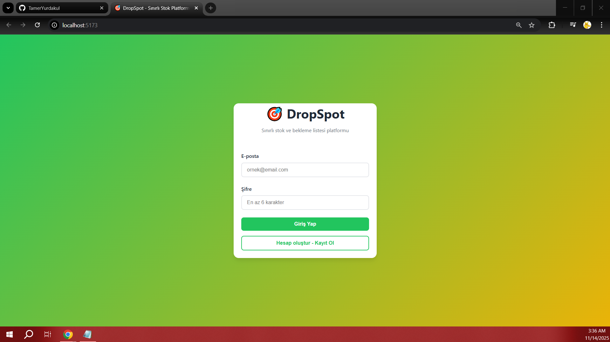
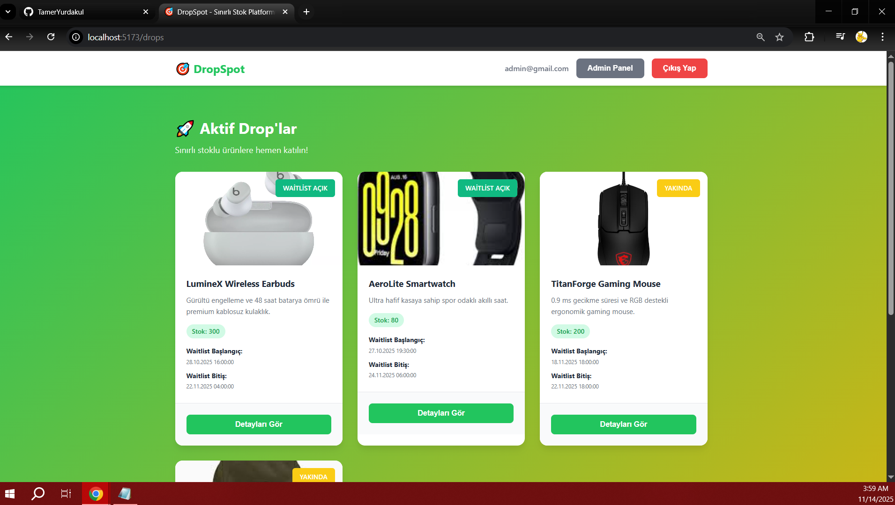
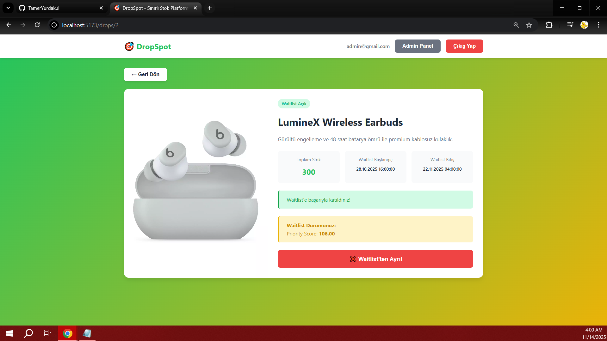
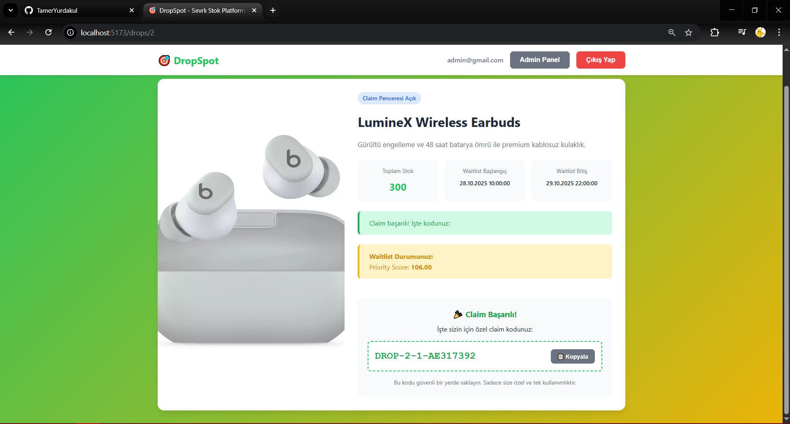
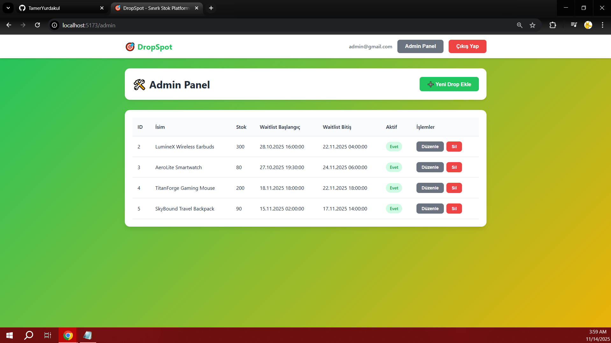

# DropSpot – Sınırlı Stok ve Bekleme Listesi Platformu

**Başlama Zamanı:** 2025.11.11 13:00  
**Teknolojiler:** Python/FastAPI, SQLite, React 19, Vite  
**Repository:** https://github.com/TamerYurdakul/drop-spot

---

## Proje Özeti

DropSpot, sınırlı stoklu ürünlerin veya etkinliklerin adil ve ölçeklenebilir bir şekilde dağıtılmasını sağlayan full-stack bir platformdur. Kullanıcılar drop'lara bekleme listesine katılabilir, öncelik skorlarına göre sıralanır ve claim penceresi açıldığında hak kazanırlarsa özel claim kodlarını alabilirler.

### Temel Özellikler
- JWT tabanlı kimlik doğrulama ve yetkilendirme
- Seed-based priority score hesaplama sistemi
- Waitlist ve claim window yönetimi
- Idempotent API işlemleri
- Admin CRUD paneli
- Modern ve responsive React frontend

---

## Mimari Açıklama

### Backend Mimarisi (FastAPI + SQLModel)

```
backend/
├── app/
│   ├── main.py              # FastAPI app, middleware, router registration
│   ├── database.py          # SQLModel engine, session management
│   ├── models.py            # Database models (User, Drop, WaitList, Claim)
│   ├── schemas.py           # Pydantic models for validation
│   ├── config.py            # Configuration (PRIORITY_SEED)
│   ├── routers/
│   │   ├── auth.py          # Authentication endpoints
│   │   ├── drops.py         # Drop, waitlist, claim endpoints
│   │   └── admin.py         # Admin CRUD endpoints
│   ├── utils/
│   │   ├── security.py      # JWT, password hashing (Argon2)
│   │   └── priority.py      # Priority score calculation
│   └── test/
│       ├── test_auth.py     # Integration test: auth flow
│       └── test_priority.py # Unit test: priority calculation
```

**Katmanlı Yapı:**
- **API Layer:** FastAPI routers (auth, drops, admin)
- **Business Logic:** Priority calculation, waitlist management, claim validation
- **Data Access:** SQLModel ORM ile database operations
- **Security:** JWT authentication, Argon2 password hashing

### Frontend Mimarisi (React + Vite)

```
frontend-react/
├── src/
│   ├── App.jsx                  # Router, route protection
│   ├── main.jsx                 # React root
│   ├── context/
│   │   └── AuthContext.jsx      # Global authentication state
│   ├── services/
│   │   └── api.js               # Axios client, interceptors
│   ├── pages/
│   │   ├── LoginPage.jsx        # Login/signup
│   │   ├── DropsListPage.jsx    # Drop list
│   │   ├── DropDetailPage.jsx   # Waitlist/claim actions
│   │   └── AdminPage.jsx        # CRUD panel
│   ├── components/
│   │   ├── Navbar.jsx           # Navigation
│   │   └── Loading.jsx          # Loading spinner
│   ├── styles/
│   │   └── main.css             # Global styles
│   └── test/
│       ├── LoginPage.test.jsx   # Component tests
│       └── DropsListPage.test.jsx
```

**Teknik Stack:**
- **State Management:** React Context API
- **Routing:** React Router DOM v7
- **HTTP Client:** Axios (interceptors for JWT)
- **Testing:** Vitest + React Testing Library
- **Build Tool:** Vite

---

## Veri Modeli

### Entity Relationship Diagram

```
┌─────────────┐         ┌─────────────┐         ┌─────────────┐
│    User     │         │    Drop     │         │   Claim     │
├─────────────┤         ├─────────────┤         ├─────────────┤
│ id (PK)     │────┐    │ id (PK)     │    ┌────│ id (PK)     │
│ email       │    │    │ name        │    │    │ user_id (FK)│
│ hashed_pw   │    │    │ description │    │    │ drop_id (FK)│
│ role        │    │    │ image_url   │    │    │ claim_code  │
│ created_at  │    │    │ total_stock │    │    │ claimed_at  │
└─────────────┘    │    │ wl_start    │    │    └─────────────┘
                   │    │ wl_end      │    │
                   │    │ is_active   │    │
                   │    │ created_at  │    │
                   │    └─────────────┘    │
                   │            │          │
                   │            │          │
                   └────────────┼──────────┘
                                │
                        ┌───────▼────────┐
                        │   WaitList     │
                        ├────────────────┤
                        │ user_id (PK,FK)│
                        │ drop_id (PK,FK)│
                        │ join_date      │
                        │ priority_score │
                        │ is_active      │
                        └────────────────┘
```

### Model Detayları

#### User
- **id**: Primary key
- **email**: Unique, indexed
- **hashed_password**: Argon2 hash
- **role**: 'user' veya 'admin'
- **created_at**: Account age için kullanılır

#### Drop
- **id**: Primary key
- **name**: Drop adı (indexed)
- **description**: Açıklama (nullable)
- **image_url**: Resim URL (nullable)
- **total_stock**: Toplam stok miktarı
- **waitlist_window_start**: Waitlist başlangıç zamanı
- **waitlist_window_end**: Waitlist bitiş zamanı
- **is_active**: Drop aktif mi?
- **created_at**: Drop oluşturulma zamanı

#### WaitList
- **user_id + drop_id**: Composite primary key
- **join_date**: Waitlist'e katılma zamanı
- **priority_score**: Seed-based hesaplanan öncelik skoru
- **is_active**: Soft delete için (leave işlemi)

#### Claim
- **id**: Primary key
- **user_id + drop_id**: Unique constraint (bir kullanıcı bir drop için sadece 1 claim)
- **claim_code**: Unique claim kodu (format: `DROP-{drop_id}-{user_id}-{random}`)
- **claimed_at**: Claim zamanı

---

## API Endpoint Listesi

### Authentication (`/auth`)

| Method | Endpoint | Açıklama | Auth | Request | Response |
|--------|----------|----------|------|---------|----------|
| POST | `/auth/signup` | Kullanıcı kaydı | No | `UserCreate` | `UserPublic` |
| POST | `/auth/login` | Kullanıcı girişi (OAuth2) | No | `OAuth2Form` | `Token` |
| GET | `/auth/me` | Mevcut kullanıcı bilgisi | Yes | - | `UserPublic` |

### Drops (`/drops`)

| Method | Endpoint | Açıklama | Auth | Request | Response |
|--------|----------|----------|------|---------|----------|
| GET | `/drops` | Aktif drop listesi | No | - | `List[DropPublic]` |
| POST | `/drops/{id}/join` | Waitlist'e katıl | Yes | - | `WaitListPublic` |
| POST | `/drops/{id}/leave` | Waitlist'ten ayrıl | Yes | - | `Message` |
| POST | `/drops/{id}/claim` | Drop claim et | Yes | - | `ClaimPublic` |

### Admin (`/admin`)

| Method | Endpoint | Açıklama | Auth | Request | Response |
|--------|----------|----------|------|---------|----------|
| GET | `/admin/drops` | Tüm drop'ları listele | Admin | - | `List[Drop]` |
| GET | `/admin/drops/{id}` | Drop detayı | Admin | - | `DropPublic` |
| POST | `/admin/drops` | Yeni drop oluştur | Admin | `DropCreate` | `Drop` |
| PUT | `/admin/drops/{id}` | Drop güncelle | Admin | `DropCreate` | `DropPublic` |
| DELETE | `/admin/drops/{id}` | Drop sil | Admin | - | `Message` |

**Not:** Admin işaretli endpoint'ler `role == 'admin'` kontrolü yapar ve 403 döner.

---

## Admin CRUD Modülü

### Yetkilendirme Mekanizması

Admin paneli role-based access control (RBAC) ile korunmaktadır:

```python
# backend/app/routers/admin.py
if current_user.role != "admin":
    raise HTTPException(status_code=403, detail="You are not allowed to perform this action.")
```

### CRUD İşlemleri

#### Create (POST /admin/drops)
- Drop oluşturma (name, description, image_url, total_stock, waitlist_window)
- Validation: tüm alanlar `DropCreate` schema'sına uygun
- is_active default: false

#### Read (GET /admin/drops, GET /admin/drops/{id})
- Tüm drop'ları listeleme (aktif + pasif)
- Tek drop detayı görüntüleme

#### Update (PUT /admin/drops/{id})
- Drop bilgilerini güncelleme
- Partial update: null olmayan alanlar güncellenir
- Waitlist/claim window'ları da güncellenebilir

#### Delete (DELETE /admin/drops/{id})
- Drop silme (cascade: waitlist ve claim'ler de silinir)
- Soft delete yerine hard delete kullanılıyor

### Frontend Admin Paneli

- **Modal-based UI**: Create/Update işlemleri modal ile
- **Confirmation dialogs**: Silme işleminde onay
- **Real-time feedback**: Success/error mesajları
- **Responsive table**: Tüm drop'ları tablo halinde gösterim

---

## Idempotency Yaklaşımı ve Transaction Yapısı

### Idempotency Garantisi

Aynı işlem birden fazla kez yapıldığında sistem durumu değişmemelidir. Bunu sağlamak için:

#### 1. Join Waitlist Idempotency
```python
# backend/app/routers/drops.py (line 65-78)
existing_waitlist = session.get(models.WaitList, (current_user.id, drop_id))

if existing_waitlist is not None:
    if existing_waitlist.is_active:
        return existing_waitlist  # İdempotent: aynı veriyi döndür
    
    # Kullanıcı önce leave yapmış, tekrar join yapıyor
    existing_waitlist.is_active = True
    existing_waitlist.join_date = datetime.now(timezone.utc)
    session.add(existing_waitlist)
    session.commit()
    return existing_waitlist
```

**Senaryo:**
- Kullanıcı 3 kez join butona basar
- İlk request: yeni waitlist entry oluşturulur
- 2. ve 3. request: existing entry döndürülür (idempotent)

#### 2. Claim Idempotency
```python
# backend/app/routers/drops.py (line 185-191)
existing = session.exec(select(models.Claim).where(
    models.Claim.user_id == current_user.id,
    models.Claim.drop_id == drop_id
)).first()

if existing is not None:
    return existing  # İdempotent: aynı claim code'u döndür
```

**Senaryo:**
- Kullanıcı claim butonuna 2 kez basar
- İlk request: yeni claim oluşturulur, code generate edilir
- 2. request: existing claim döndürülür (idempotent)

#### 3. IntegrityError Handling
```python
# backend/app/routers/drops.py (line 116-126)
try:
    session.add(new_waitlist_entry)
    session.commit()
except IntegrityError:
    session.rollback()  # Transaction geri al
    existing = session.get(models.WaitList, (current_user.id, drop_id))
    if existing:
        return existing  # Race condition: başka thread oluşturmuş
    raise HTTPException(status_code=500, detail="Failed to join waitlist")
```

**Race Condition Senaryosu:**
- 2 request aynı anda gelir
- Her ikisi de `existing_waitlist == None` görür
- Her ikisi de insert yapmaya çalışır
- Biri başarılı, diğeri IntegrityError alır
- IntegrityError alan rollback yapar ve existing'i döndürür

### Transaction Yönetimi

#### Session Management
```python
# backend/app/database.py (line 17-25)
def get_session():
    with Session(engine) as session:
        try:
            yield session
        except Exception:
            session.rollback()  # Hata durumunda rollback
            raise
        finally:
            session.close()
```

**Özellikler:**
- `with Session()` context manager: otomatik cleanup
- Exception handling: hata durumunda rollback
- FastAPI Dependency Injection ile kullanım

#### Atomic Operations
- SQLModel/SQLAlchemy transaction'ları otomatik yönetir
- `session.commit()` başarısız olursa otomatik rollback
- `session.add()` + `session.commit()`: atomic operation

### Soft Delete Pattern
```python
# WaitList.is_active kullanımı
waitlist_entry.is_active = False  # Fiziksel silme yerine
session.add(waitlist_entry)
session.commit()
```

**Avantajları:**
- Kullanıcı tekrar join yaparsa aynı entry'yi aktifleştirir
- Priority score korunur (yeniden hesaplanmaz)
- Audit trail: leave/rejoin history

---

## Seed Üretim Yöntemi ve Kullanımı

### Seed Üretimi

Yönergeye uygun olarak deterministik seed üretimi:

```python
# seed.py
import hashlib

start_time = "202511111300"  # Başlama zamanı: 2025.11.11 13.00
first_commit_epoch = "1762855868"
remote_url = "https://github.com/TamerYurdakul/drop-spot.git"

def generate_seed(remote, epoch, start):
    raw = f"{remote}|{epoch}|{start}"
    return hashlib.sha256(raw.encode()).hexdigest()[:12]

seed = generate_seed(
    remote=remote_url,
    epoch=first_commit_epoch,
    start=start_time,
)
# Çıktı: 94b2521c4b73
```

### Seed Kullanımı

#### 1. Configuration
```python
# backend/app/config.py
PRIORITY_SEED = "94b2521c4b73"
```

#### 2. Katsayı Üretimi
```python
# backend/app/utils/priority.py
def get_priority(seed: str):
    A = 7 + (int(seed[0:2], 16) % 5)  # 7 + (148 % 5) = 7 + 3 = 10
    B = 13 + (int(seed[2:4], 16) % 7) # 13 + (181 % 7) = 13 + 6 = 19
    C = 3 + (int(seed[4:6], 16) % 3)  # 3 + (82 % 3) = 3 + 1 = 4
    return A, B, C

A, B, C = get_priority(PRIORITY_SEED)
# A=10, B=19, C=4
```

#### 3. Priority Score Hesaplama
```python
# backend/app/utils/priority.py
def calculate_priority(base, signup_latency_ms, account_age_days, rapid_actions):
    return base + (signup_latency_ms % A) + (account_age_days % B) - (rapid_actions % C)
```

**Formül Örneği:**
```
base = 100
signup_latency_ms = 5000  # Drop oluşturulduktan 5 saniye sonra join
account_age_days = 30     # Hesap 30 günlük
rapid_actions = 2         # Kullanıcının 2 aktif waitlist'i var

priority_score = 100 + (5000 % 10) + (30 % 19) - (2 % 4)
               = 100 + 0 + 11 - 2
               = 109
```

### Seed Özellikleri

**Deterministik:**
- Aynı seed her zaman aynı A, B, C değerlerini üretir
- Her proje için unique seed

**Adil Sıralama:**
- `signup_latency`: Erken join yapanlar avantajlı
- `account_age`: Eski hesaplar avantajlı
- `rapid_actions`: Çok fazla drop'a join yapanlar penalize edilir

**Modulo Kullanımı:**
- Büyük değerleri normalize eder
- Score range'i kontrol edilebilir tutar

---

## Kurulum Adımları

### Gereksinimler

- **Python**: 3.10+
- **Node.js**: 18+
- **npm**: 9+

### Backend Kurulumu

```bash
# 1. Repository'yi clone'la
git clone https://github.com/TamerYurdakul/drop-spot.git
cd drop-spot

# 2. Python virtual environment oluştur
cd backend
python -m venv .venv

# 3. Virtual environment'ı aktifleştir
# Windows:
.venv\Scripts\activate
# Linux/Mac:
source .venv/bin/activate

# 4. Bağımlılıkları yükle
pip install -r requirements.txt

# 5. Backend'i başlat
python app/main.py

# Backend çalışacak: http://127.0.0.1:8000
# API Docs: http://127.0.0.1:8000/docs
```

### Frontend Kurulumu

```bash
# 1. Frontend dizinine git
cd frontend-react

# 2. Bağımlılıkları yükle
npm install

# 3. Development server'ı başlat
npm run dev

# Frontend çalışacak: http://localhost:5173
```

### İlk Admin Kullanıcı Oluşturma

Backend başladığında tüm kullanıcılar default olarak `role='user'` ile oluşturulur. Admin paneline erişmek için:

#### Yöntem 1: SQLite Browser ile
```bash
# 1. SQLite browser indir (https://sqlitebrowser.org/)
# 2. backend/app/drop_spot.db dosyasını aç
# 3. user tablosuna git
# 4. İlgili kullanıcının role değerini 'user' -> 'admin' olarak güncelle
# 5. Değişiklikleri kaydet
```

#### Yöntem 2: Models.py'yi Geçici Değiştir
```python
# backend/app/models.py (line 16)
# Geçici olarak default'u değiştir
role : str = Field(nullable=False, default='admin')  # 'user' -> 'admin'

# Backend'i restart et
# Admin kullanıcı oluştur
# Sonra tekrar default='user' yap
```

### Test Çalıştırma

#### Backend Tests
```bash
cd backend
pytest -v

# Çıktı:
# backend/app/test/test_auth.py::test_auth_flow PASSED
# backend/app/test/test_priority.py::test_calculate_priority PASSED
```

#### Frontend Tests
```bash
cd frontend-react
npm test

# Çıktı:
# src/test/LoginPage.test.jsx (3 tests)
# src/test/DropsListPage.test.jsx (4 tests)
# Test Files  2 passed (2)
# Tests  7 passed (7)
```

---

## Ekran Görüntüleri

### 1. Login / Signup Sayfası


**Açıklama:**  
Kullanıcılar e-posta ve şifre ile kayıt olabilir veya giriş yapabilir. Login/Signup toggle buton ile mod değiştirilir. JWT token authentication ile güvenli giriş. Başarılı girişten sonra otomatik olarak drops listesi sayfasına yönlendirilir.

---

### 2. Drop Listesi


**Açıklama:**  
Aktif drop'ların listelendiği sayfa. Her drop için:
- Drop adı ve açıklaması
- Toplam stok miktarı
- Waitlist başlangıç ve bitiş tarihleri
- Status badge (Waitlist Açık / Henüz Açılmadı / Claim Penceresi)

Responsive card layout ile mobil uyumlu tasarım. "Detayları Gör" butonu ile drop detay sayfasına geçiş.

---

### 3. Drop Detay Sayfası


**Açıklama:**  
Tek bir drop'un detaylı görünümü. Kullanıcı işlemleri:
- **Waitlist'e Katıl:** Waitlist penceresi açıkken join işlemi
- **Waitlist'ten Ayrıl:** Aktif waitlist'ten çıkış
- **Waitlist Durumu:** Mevcut sıra, priority score, katılım tarihi
- **Claim Yap:** Claim penceresi açıldığında hak kazanan kullanıcılar için

Real-time status gösterimi: Waitlist başlangıç/bitiş saatleri, stok bilgisi. Yeşil-sarı tema ile modern UI.

---

### 4. Claim Başarılı


**Açıklama:**  
Başarılı claim işlemi sonrası özel claim code gösterimi. Claim code formatı: `DROP-{drop_id}-{user_id}-{random}`. 

**Özellikler:**
- Unique claim code (UUID-based)
- Kopyala butonu (clipboard API)
- Güvenlik notu: "Bu kodu güvenli bir yerde saklayın"
- Claim tarihi bilgisi

Bu kod kullanıcının drop'u hak ettiğini kanıtlar ve tek kullanımlıktır.

---

### 5. Admin CRUD Paneli


**Açıklama:**  
Sadece admin kullanıcıların erişebildiği CRUD paneli. Özellikler:

**Drop Listesi:**
- Tüm drop'lar (aktif + pasif) tablo formatında
- ID, isim, stok, waitlist tarihleri, aktiflik durumu

**İşlemler:**
- **Yeni Drop Ekle:** Modal ile form (name, description, image_url, stock, waitlist_window, is_active)
- **Düzenle:** Existing drop'u update et
- **Sil:** Confirmation dialog ile drop silme (cascade delete)

Modal-based UI, responsive tablo, success/error feedback mesajları.

---

## Teknik Tercihler ve Kişisel Katkılar

### Backend Kararları

#### 1. FastAPI + SQLModel
**Neden?**
- Modern Python framework (async support)
- Automatic API documentation (Swagger UI)
- SQLModel: Pydantic + SQLAlchemy integration (type safety)
- Hızlı development cycle

**Alternatifler:**
- Django REST Framework (daha ağır, bu proje için fazla)
- Flask (async support zayıf)

#### 2. Argon2 Password Hashing
**Neden?**
- Modern ve güvenli (bcrypt'ten daha iyi)
- Memory-hard algorithm (brute force'a karşı dirençli)
- OWASP recommended

```python
# backend/app/utils/security.py
from argon2 import PasswordHasher
ph = PasswordHasher()
hashed = ph.hash(password)  # Argon2id algorithm
```

#### 3. SQLite + Soft Delete Pattern
**Neden?**
- Kolay setup (no external database)
- WaitList için `is_active` flag (rejoin senaryoları)
- Priority score preservation

**Production'da:**
- PostgreSQL'e geçiş kolay (SQLModel ORM sayesinde)
- Migration tool: Alembic

#### 4. Waitlist Window Logic
**Kişisel Katkı:**
- Yönerge "claim window" diyor, ben "waitlist window" yaptım
- **Mantık:** Kullanıcı önce waitlist'e join yapar, waitlist bitince otomatik claim açılır
- Daha adil: herkes aynı waitlist penceresinde join yapar

```python
# backend/app/routers/drops.py (line 44-63)
if now < wl_start:
    raise HTTPException(403, "Waitlist has not started yet")
if now > wl_end:
    raise HTTPException(403, "Waitlist has closed")
```

### Frontend Kararları

#### 1. React 18 + Vite (Next.js yerine)
**Neden?**
- Vite: fast HMR, instant server start
- SPA architecture: bu proje için yeterli (SEO gerekmiyor)
- Next.js: bu proje için fazla (SSR/SSG gerekmez)

**Trade-off:**
- Next.js'de automatic code splitting daha iyi
- Ama single-page app için Vite yeterli

#### 2. Context API (Redux yerine)
**Neden?**
- Basit state management (sadece auth state gerekli)
- No external dependency
- Redux: bu proje için fazla

```javascript
// frontend-react/src/context/AuthContext.jsx
const AuthContext = createContext();
export const useAuth = () => useContext(AuthContext);
```

#### 3. localStorage for State Persistence
**Kişisel Katkı:**
- Backend `GET /drops` kullanıcıya özel veri döndürmüyor
- localStorage ile waitlist/claim state'i persist ediliyor
- Her 10 saniyede backend sync

**Alternatif:**
- Backend'i değiştirip kullanıcı-spesifik veri döndürmek
- Ama bu daha fazla backend değişikliği gerektirir

#### 4. Axios Interceptors
**Kişisel Katkı:**
- Otomatik JWT token ekleme
- Global error handling
- Request/response logging (development)

```javascript
// frontend-react/src/services/api.js
api.interceptors.request.use((config) => {
    const token = TokenManager.get();
    if (token && !isPublicEndpoint) {
        config.headers.Authorization = `Bearer ${token}`;
    }
    return config;
});
```

### Test Stratejisi

#### Backend Tests
- **Integration Test:** Full auth flow (signup -> login -> /me)
- **Unit Test:** Priority calculation (monkeypatch for deterministic test)

#### Frontend Tests
- **Component Tests:** LoginPage, DropsListPage
- **Mock Strategy:** API calls mocked, focus on UI logic
- **Coverage:** 7 test cases (yönerge minimum 2 istiyor)

**Eksik (ideal'de olmalı):**
- E2E tests (Playwright/Cypress)
- Backend waitlist/claim integration tests
- Frontend DropDetailPage tests

### Güvenlik Kararları

#### 1. Role-Based Access Control
```python
# backend/app/routers/admin.py (line 24)
if current_user.role != "admin":
    raise HTTPException(status_code=403, ...)
```

#### 2. Protected Routes (Frontend)
```javascript
// frontend-react/src/App.jsx
const ProtectedRoute = ({ children, adminOnly }) => {
    if (!user) return <Navigate to="/" />;
    if (adminOnly && user.role !== 'admin') return <Navigate to="/drops" />;
    return children;
};
```

#### 3. CORS Configuration
```python
# backend/app/main.py
app.add_middleware(
    CORSMiddleware,
    allow_origins=["*"],  # Production'da specific origin olmalı
    allow_credentials=True,
)
```

**Production için:**
- `allow_origins=["https://yourdomain.com"]`
- Rate limiting
- HTTPS-only cookies

---

## Proje İstatistikleri

### Backend
- **Toplam Satır:** ~1200 lines
- **Test Coverage:** 2 test file, 2 test case (auth flow + priority calculation)
- **API Endpoints:** 13 endpoint (3 auth, 4 drops, 5 admin, 1 root)
- **Models:** 4 model (User, Drop, WaitList, Claim)

### Frontend
- **Toplam Satır:** ~2000 lines
- **Test Coverage:** 2 test file, 7 test case (LoginPage + DropsListPage)
- **Components:** 6 component (4 page + 2 shared)
- **Pages:** 4 sayfa (Login, Drops List, Drop Detail, Admin Panel)

### Commit History
- Feature branch'ler: 8 branch
- Total commits: 20+ commit (anlamlı ve okunabilir commit messages)

---

## Lisans

Bu proje Alpaco Full Stack Developer Case için geliştirilmiştir.

---

## Geliştirici

**Tamer Yurdakul**  
GitHub: [@TamerYurdakul](https://github.com/TamerYurdakul)  
Repository: [drop-spot](https://github.com/TamerYurdakul/drop-spot)

---

**Son Güncelleme:** 2025.11.14  
**Proje Durumu:** Tamamlandı
